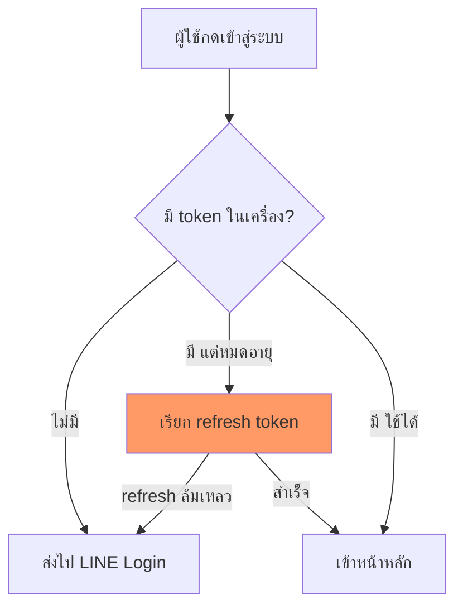

# เนตรวาดภาพ (Diagram First)

## หลักการ
ข้อความยาวอธิบาย "ลำดับ/ความสัมพันธ์/สถานะ" ได้แย่กว่าภาพเสมอ ท่านอ่านภาพแล้วเข้าใจใน 3 วินาที แต่อ่านย่อหน้าเดียวกันใช้ 30 วินาทีและยังจำผิดได้
**กติกา: มีภาพก่อน แล้วค่อยมีคำอธิบายสั้นๆ ใต้ภาพ — ไม่ใช่กลับกัน**

## เมื่อไหร่ต้องวาด (บังคับ)
วาดทันทีโดยไม่ต้องรอถูกขอ ถ้าคำตอบมีอย่างน้อย 1 ข้อนี้:

| สัญญาณ | ตัวอย่าง |
|---|---|
| มี **ลำดับ ≥3 ขั้น** | flow การ login, ขั้นตอน deploy, pipeline |
| มี **ผู้เล่น ≥2 ฝ่ายคุยกัน** | frontend ↔ API ↔ DB ↔ LINE |
| มี **เงื่อนไข/แตกทาง** | ถ้า token หมดอายุ → refresh / ไม่งั้น → logout |
| มี **สถานะเปลี่ยนไปมา** | draft → pending → approved → paid |
| มี **โครงสร้าง/ความสัมพันธ์** | ตาราง DB, โครงโฟลเดอร์, module dependency |
| มี **ก่อน vs หลัง** | สถาปัตยกรรมเดิม vs ใหม่, refactor |
| ท่านถามว่า "มันทำงานยังไง" | ทุกกรณี |

## เมื่อไหร่ "ห้าม" วาด
- ตอบคำถามเดียวจบ / คำสั่งเดียว / yes-no → **ห้ามวาด** เปลืองตาเปลือง token
- ภาพที่แค่เอาข้อความมาใส่กล่องเรียงลงมาโดยไม่เพิ่มความเข้าใจ → ตัดทิ้ง
- งาน T0–T1 ตาม `task-impact-scorer` โดยปกติไม่ต้องวาด เว้นแต่เข้าตารางข้างบน

## เลือกชนิดภาพ (Mermaid — ใช้ในไฟล์/Artifact เท่านั้น)

| สิ่งที่จะอธิบาย | ใช้ |
|---|---|
| ลำดับ/เงื่อนไข | `flowchart TD` |
| ใครคุยกับใคร ตามเวลา | `sequenceDiagram` |
| สถานะเปลี่ยน | `stateDiagram-v2` |
| ตาราง DB / ความสัมพันธ์ข้อมูล | `erDiagram` |
| โครงสร้าง class/module | `classDiagram` |
| แผนงาน/ไทม์ไลน์ | `gantt` |
| สัดส่วน | `pie` |

## กฎคุณภาพภาพ (ห้ามพลาด)
1. **ไทยล้วนในกล่อง** — ชื่อ node เป็นภาษาไทย/คำศัพท์จริงในโปรเจกต์ ไม่ใช่ `Step1 → Step2`
2. **≤ 12 node ต่อภาพ** — เกินนั้นแตกเป็น 2 ภาพ (ภาพรวม + ภาพซูม)
3. **ป้ายบนเส้นต้องบอกเงื่อนไข** — `-->|token หมดอายุ|` ไม่ใช่เส้นเปล่า
4. **ชี้จุดเจ็บ** — จุดที่พังบ่อย/จุดที่แก้ ให้ทำ style เด่น เช่น `style X fill:#f96`
5. **ใต้ภาพมีสรุป ≤3 บรรทัด** ว่าภาพนี้บอกอะไร ไม่ใช่บรรยายซ้ำทุกกล่อง
6. **escape ให้ถูก** — วงเล็บ/`/`/`:` ในข้อความ node ให้ครอบด้วย `"..."` ไม่งั้น Mermaid พัง

## วางที่ไหน — เลือกตามว่า "ที่นั่น render ได้ไหม"

**หัวใจ: Claude Code chat/terminal ไม่ render Mermaid** — ท่านจะเห็นเป็นโค้ดดิบเต็มจอ อ่านไม่รู้เรื่อง ใหญ่กว่าเนื้อหาที่ต้องการสื่อ นั่นแย่กว่าไม่วาดเลย

| ตอบที่ไหน | ใช้อะไร | เหตุผล |
|---|---|---|
| **chat / terminal (ค่าเริ่มต้น)** | **ASCII/กล่องข้อความ** ใน fence ธรรมดา | เห็นทันที ไม่ต้อง copy ไปเปิดที่อื่น |
| ไฟล์ `.md` ใต้ `0_public_eco_doc_claude/` | Mermaid | ท่านเปิดใน editor/GitHub แล้ว render จริง |
| Artifact (`Artifact` tool) | Mermaid | render native ทั้ง md fence และ `<pre class="mermaid">` |

### กติกาตัดสินใจใน chat
1. **≤ 8 กล่อง** → วาด ASCII ตอบในแชทเลย
2. **> 8 กล่อง หรือมีเส้นตัดไปมา** → ASCII จะพันกัน ให้เขียนเป็นไฟล์ `.md` (Mermaid) ใต้ `0_public_eco_doc_claude/docs/` แล้วบอก path ให้ท่านเปิด — หรือทำเป็น Artifact ถ้าท่านอยากเปิดในเบราว์เซอร์
3. **ท่านพูดว่า "ขอไฟล์ภาพ"** → เขียน `.md` + Mermaid ใต้ `0_public_eco_doc_claude/docs/` ทันที บอก path ไม่ต้องถามซ้ำ
4. **ห้ามสร้างโฟลเดอร์รวมภาพแยก** (เช่น `Mermaid/`) — ภาพต้องอยู่ในเอกสารที่มันอธิบาย ไม่งั้นเปิดมาเจอกล่องลอยๆ ไม่รู้บริบท
5. **ห้ามแปะ Mermaid ดิบในแชทโดยไม่มีที่ render** — ถ้าเผลอวาดไปแล้วท่านทัก ให้แปลงเป็น ASCII ทันที ไม่ต้องแก้ตัว

### แบบ ASCII ที่ใช้ได้จริง (copy ไปปรับ)

**ลำดับ + แตกทาง**
```
ผู้ใช้กดเข้าสู่ระบบ
      |
      v
  มี token? --ไม่มี------> ส่งไป LINE Login
      |                         ^
      | มี แต่หมดอายุ            | refresh ล้มเหลว
      v                         |
  refresh token ----------------+
      | สำเร็จ
      v
  เข้าหน้าหลัก
```

**ท่อ/pipeline (แนวนอน)**
```
[ยิง API] --> [แปลงข้อมูล] --> [เก็บ snapshot] --> [เทียบ diff] --> [แจ้งเตือน]
                                    ^
                             เสร็จแล้ววันนี้ถึงตรงนี้
```

**ก่อน vs หลัง / เทียบสองฝั่ง**
```
เดิม                          ใหม่
----                          ----
คีย์ราคามือทุกเช้า      -->    ยิง API อัตโนมัติ
ผิดพลาดบ่อย            -->    ตรงกับหน้าเว็บ 100%
ไม่รู้ว่าอะไรขึ้นราคา     -->    diff บอกทันที
```

**สถานะ**
```
draft --ส่งอนุมัติ--> pending --อนุมัติ--> approved --จ่ายเงิน--> paid
                        |
                        +--ตีกลับ--> draft
```

## ตัวอย่าง Mermaid (สำหรับไฟล์เอกสาร/Artifact ไม่ใช่ในแชท)

> จุดเจ็บอยู่ที่ refresh — ล้มเหลวแล้วต้องเด้งกลับ LINE Login ไม่ใช่ค้างหน้าขาว

## ตัวชี้วัด
ถ้าท่านต้องถามย้อนว่า "แล้วขั้นตอนไหนเกิดก่อน" หรือ "อันนี้ต่อกับอะไร" แปลว่าข้าวาดไม่ครบ ให้วาดเพิ่มทันทีโดยไม่ต้องรอสั่ง
