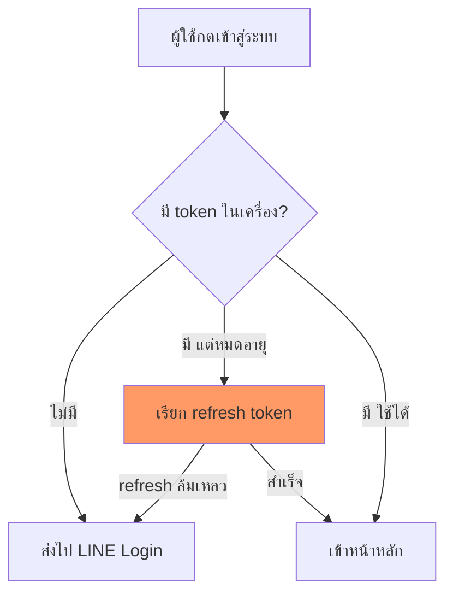

# เนตรวาดภาพ (Diagram First)

## หลักการ
ข้อความยาวอธิบาย "ลำดับ/ความสัมพันธ์/สถานะ" ได้แย่กว่าภาพเสมอ ท่านอ่านภาพแล้วเข้าใจใน 3 วินาที แต่อ่านย่อหน้าเดียวกันใช้ 30 วินาทีและยังจำผิดได้
**กติกา: มีภาพก่อน แล้วค่อยมีคำอธิบายสั้นๆ ใต้ภาพ — ไม่ใช่กลับกัน**

## เมื่อไหร่ต้องวาด (บังคับ)
วาดทันทีโดยไม่ต้องรอถูกขอ ถ้าคำตอบมีอย่างน้อย 1 ข้อนี้:

| สัญญาณ | ตัวอย่าง |
|---|---|
| มี **ลำดับ ≥3 ขั้น** | flow การ login, ขั้นตอน deploy, pipeline |
| มี **ผู้เล่น ≥2 ฝ่ายคุยกัน** | frontend ↔ API ↔ DB ↔ LINE |
| มี **เงื่อนไข/แตกทาง** | ถ้า token หมดอายุ → refresh / ไม่งั้น → logout |
| มี **สถานะเปลี่ยนไปมา** | draft → pending → approved → paid |
| มี **โครงสร้าง/ความสัมพันธ์** | ตาราง DB, โครงโฟลเดอร์, module dependency |
| มี **ก่อน vs หลัง** | สถาปัตยกรรมเดิม vs ใหม่, refactor |
| ท่านถามว่า "มันทำงานยังไง" | ทุกกรณี |

## เมื่อไหร่ "ห้าม" วาด
- ตอบคำถามเดียวจบ / คำสั่งเดียว / yes-no → **ห้ามวาด** เปลืองตาเปลือง token
- ภาพที่แค่เอาข้อความมาใส่กล่องเรียงลงมาโดยไม่เพิ่มความเข้าใจ → ตัดทิ้ง
- งาน T0–T1 ตาม `task-impact-scorer` โดยปกติไม่ต้องวาด เว้นแต่เข้าตารางข้างบน

## เลือกชนิดภาพ (Mermaid)

| สิ่งที่จะอธิบาย | ใช้ |
|---|---|
| ลำดับ/เงื่อนไข | `flowchart TD` |
| ใครคุยกับใคร ตามเวลา | `sequenceDiagram` |
| สถานะเปลี่ยน | `stateDiagram-v2` |
| ตาราง DB / ความสัมพันธ์ข้อมูล | `erDiagram` |
| โครงสร้าง class/module | `classDiagram` |
| แผนงาน/ไทม์ไลน์ | `gantt` |
| สัดส่วน | `pie` |

## กฎคุณภาพภาพ (ห้ามพลาด)
1. **ไทยล้วนในกล่อง** — ชื่อ node เป็นภาษาไทย/คำศัพท์จริงในโปรเจกต์ ไม่ใช่ `Step1 → Step2`
2. **≤ 12 node ต่อภาพ** — เกินนั้นแตกเป็น 2 ภาพ (ภาพรวม + ภาพซูม)
3. **ป้ายบนเส้นต้องบอกเงื่อนไข** — `-->|token หมดอายุ|` ไม่ใช่เส้นเปล่า
4. **ชี้จุดเจ็บ** — จุดที่พังบ่อย/จุดที่แก้ ให้ทำ style เด่น เช่น `style X fill:#f96`
5. **ใต้ภาพมีสรุป ≤3 บรรทัด** ว่าภาพนี้บอกอะไร ไม่ใช่บรรยายซ้ำทุกกล่อง
6. **escape ให้ถูก** — วงเล็บ/`/`/`:` ในข้อความ node ให้ครอบด้วย `"..."` ไม่งั้น Mermaid พัง

## วางที่ไหน
- **ตอบใน chat/terminal:** ใส่ Mermaid ใน fence ` ```mermaid ` (ท่าน copy ไปเปิดที่ไหนก็ render). ถ้าภาพเล็กมาก (≤5 กล่อง เส้นตรง) ใช้ ASCII ธรรมดาได้เลย จะเห็นทันทีไม่ต้อง copy
- **เอกสาร:** ฝัง Mermaid ในไฟล์ใต้ `0_public_eco_doc_claude/` ตามกฎศูนย์เอกสารที่เดียว
- **plan / handoff / analysis / report:** ทุกฉบับต้องมีอย่างน้อย 1 ภาพรวมด้านบนสุด

## ตัวอย่างสั้น

> จุดเจ็บอยู่ที่ refresh — ล้มเหลวแล้วต้องเด้งกลับ LINE Login ไม่ใช่ค้างหน้าขาว

## ตัวชี้วัด
ถ้าท่านต้องถามย้อนว่า "แล้วขั้นตอนไหนเกิดก่อน" หรือ "อันนี้ต่อกับอะไร" แปลว่าข้าวาดไม่ครบ ให้วาดเพิ่มทันทีโดยไม่ต้องรอสั่ง
