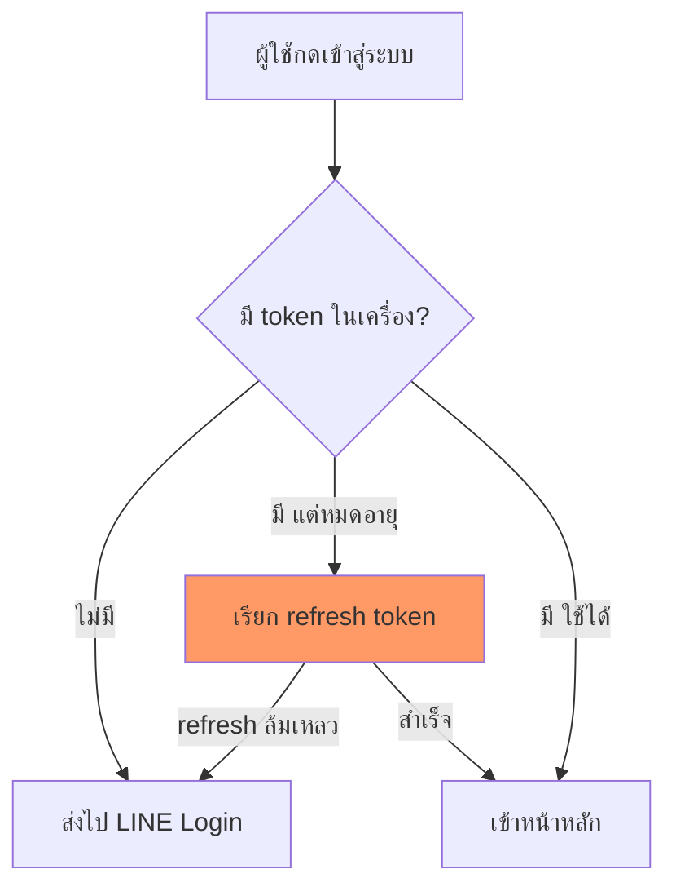

# เนตรวาดภาพ (Diagram First)

## หลักการ
ข้อความยาวอธิบาย "ลำดับ/ความสัมพันธ์/สถานะ" ได้แย่กว่าภาพเสมอ ท่านอ่านภาพแล้วเข้าใจใน 3 วินาที แต่อ่านย่อหน้าเดียวกันใช้ 30 วินาทีและยังจำผิดได้
**กติกา: มีภาพก่อน แล้วค่อยมีคำอธิบายสั้นๆ ใต้ภาพ — ไม่ใช่กลับกัน**

## เมื่อไหร่ต้องวาด (บังคับ)
วาดทันทีโดยไม่ต้องรอถูกขอ ถ้าคำตอบมีอย่างน้อย 1 ข้อนี้:

| สัญญาณ | ตัวอย่าง |
|---|---|
| มี **ลำดับ ≥3 ขั้น** | flow การ login, ขั้นตอน deploy, pipeline |
| มี **ผู้เล่น ≥2 ฝ่ายคุยกัน** | frontend ↔ API ↔ DB ↔ LINE |
| มี **เงื่อนไข/แตกทาง** | ถ้า token หมดอายุ → refresh / ไม่งั้น → logout |
| มี **สถานะเปลี่ยนไปมา** | draft → pending → approved → paid |
| มี **โครงสร้าง/ความสัมพันธ์** | ตาราง DB, โครงโฟลเดอร์, module dependency |
| มี **ก่อน vs หลัง** | สถาปัตยกรรมเดิม vs ใหม่, refactor |
| ท่านถามว่า "มันทำงานยังไง" | ทุกกรณี |

## เมื่อไหร่ "ห้าม" วาด
- ตอบคำถามเดียวจบ / คำสั่งเดียว / yes-no → **ห้ามวาด** เปลืองตาเปลือง token
- ภาพที่แค่เอาข้อความมาใส่กล่องเรียงลงมาโดยไม่เพิ่มความเข้าใจ → ตัดทิ้ง
- งาน T0–T1 ตาม `task-impact-scorer` โดยปกติไม่ต้องวาด เว้นแต่เข้าตารางข้างบน

## เลือกชนิดภาพ (Mermaid — ใช้ในไฟล์/Artifact เท่านั้น)

| สิ่งที่จะอธิบาย | ใช้ |
|---|---|
| ลำดับ/เงื่อนไข | `flowchart TD` |
| ใครคุยกับใคร ตามเวลา | `sequenceDiagram` |
| สถานะเปลี่ยน | `stateDiagram-v2` |
| ตาราง DB / ความสัมพันธ์ข้อมูล | `erDiagram` |
| โครงสร้าง class/module | `classDiagram` |
| แผนงาน/ไทม์ไลน์ | `gantt` |
| สัดส่วน | `pie` |

## กฎคุณภาพภาพ (ห้ามพลาด)
1. **ไทยล้วนในกล่อง** — ชื่อ node เป็นภาษาไทย/คำศัพท์จริงในโปรเจกต์ ไม่ใช่ `Step1 → Step2`
2. **≤ 12 node ต่อภาพ** — เกินนั้นแตกเป็น 2 ภาพ (ภาพรวม + ภาพซูม)
3. **ป้ายบนเส้นต้องบอกเงื่อนไข** — `-->|token หมดอายุ|` ไม่ใช่เส้นเปล่า
4. **ชี้จุดเจ็บ** — จุดที่พังบ่อย/จุดที่แก้ ให้ทำ style เด่น เช่น `style X fill:#f96`
5. **ใต้ภาพมีสรุป ≤3 บรรทัด** ว่าภาพนี้บอกอะไร ไม่ใช่บรรยายซ้ำทุกกล่อง
6. **escape ให้ถูก** — วงเล็บ/`/`/`:` ในข้อความ node ให้ครอบด้วย `"..."` ไม่งั้น Mermaid พัง

## วางที่ไหน — เลือกตามว่า "ที่นั่น render ได้ไหม"

**หัวใจ: Claude Code chat/terminal ไม่ render Mermaid** — ท่านจะเห็นเป็นโค้ดดิบเต็มจอ อ่านไม่รู้เรื่อง ใหญ่กว่าเนื้อหาที่ต้องการสื่อ นั่นแย่กว่าไม่วาดเลย

| ตอบที่ไหน | ใช้อะไร | เหตุผล |
|---|---|---|
| **chat / terminal (ค่าเริ่มต้น)** | **ASCII/กล่องข้อความ** ใน fence ธรรมดา | เห็นทันที ไม่ต้อง copy ไปเปิดที่อื่น |
| ไฟล์ `.md` ใต้ `0_public_eco_doc_claude/` | Mermaid | ท่านเปิดใน editor/GitHub แล้ว render จริง |
| Artifact (`Artifact` tool) | Mermaid | render native ทั้ง md fence และ `<pre class="mermaid">` |

### กติกาตัดสินใจใน chat
1. **≤ 8 กล่อง** → วาด ASCII ตอบในแชทเลย
2. **> 8 กล่อง หรือมีเส้นตัดไปมา** → ASCII จะพันกัน ให้เขียนเป็นไฟล์ `.md` (Mermaid) ใต้ `0_public_eco_doc_claude/docs/` แล้วบอก path ให้ท่านเปิด — หรือทำเป็น Artifact ถ้าท่านอยากเปิดในเบราว์เซอร์
3. **ท่านพูดว่า "ขอไฟล์ภาพ"** → เขียน `.md` + Mermaid ใต้ `0_public_eco_doc_claude/docs/` ทันที บอก path ไม่ต้องถามซ้ำ
4. **ห้ามสร้างโฟลเดอร์รวมภาพแยก** (เช่น `Mermaid/`) — ภาพต้องอยู่ในเอกสารที่มันอธิบาย ไม่งั้นเปิดมาเจอกล่องลอยๆ ไม่รู้บริบท
5. **ห้ามแปะ Mermaid ดิบในแชทโดยไม่มีที่ render** — ถ้าเผลอวาดไปแล้วท่านทัก ให้แปลงเป็น ASCII ทันที ไม่ต้องแก้ตัว

### จัดคอลัมน์ ASCII ให้เส้นตรงจริง (กฎเหล็ก)

**ต้นเหตุที่เส้นเยื้อง: อักษรไทยความกว้างไม่คงที่** — terminal ส่วนใหญ่เรนเดอร์ไทยกว้างไม่เท่า ASCII และสระบน/ล่าง (ิ ี ุ ู ่ ้ ์) **ไม่กินความกว้างเลย** การนับตัวอักษรแล้วเว้นวรรคให้เท่ากันจึงเชื่อไม่ได้ ตัวอย่างเดียวกันเปิดคนละเครื่องเยื้องคนละแบบ

1. **บรรทัดที่มีเส้น (`|` `+` `v` `^`) ห้ามมีอักษรไทยอยู่ซ้ายมือของเส้น** — ให้เส้นชิดซ้ายหรือมีแค่ช่องว่าง ASCII นำหน้า นี่คือกฎเดียวที่รับประกันว่าตรงทุกเครื่อง
2. **ป้ายกำกับเส้นไว้ขวาของเส้นเสมอ** เช่น `|` แล้วเว้นวรรคแล้วค่อย `มี แต่หมดอายุ` — อย่าแทรกไทยไว้ระหว่างเส้นสองเส้น เพราะเส้นขวาจะถูกดันเยื้อง
3. **ต้องเทียบเป็นคอลัมน์ (ก่อน-vs-หลัง, ตารางเลือก) → ใช้ตาราง Markdown ไม่ใช่ ASCII** — terminal เรนเดอร์ตารางให้ตรงเอง ไม่ต้องนับช่องว่าง
4. **ผังแนวนอนยาว ๆ ที่มีเส้นชี้ขึ้นจากกลางแถว → เปลี่ยนเป็นแนวตั้ง** ชี้ด้วยลูกศรท้ายบรรทัดแทน (`<-- อยู่ตรงนี้`) ไม่ต้องเล็งคอลัมน์
5. **ตรวจก่อนส่ง:** กวาดตาทุกบรรทัดที่มีเส้น ถ้าบรรทัดไหนมีไทยอยู่ก่อนเส้น = ผิดข้อ 1 ให้จัดใหม่ อย่าปล่อยผ่านเพราะ "ก็พออ่านได้"

**ผิด** (ไทยอยู่ซ้ายเส้น เส้นล่างเยื้องจากกล่องบน)
```
ยิง API --> เก็บ snapshot --> เทียบ diff
                  |
             เสร็จถึงตรงนี้
```

**ถูก** (แนวตั้ง เส้นชิดซ้าย ป้ายอยู่ขวา)
```
ยิง API
  |
  v
เก็บ snapshot     <-- เสร็จถึงตรงนี้
  |
  v
เทียบ diff
```

### แบบ ASCII ที่ใช้ได้จริง (copy ไปปรับ)

**ลำดับ + แตกทาง**
```
ผู้ใช้กดเข้าสู่ระบบ
      |
      v
  มี token? --ไม่มี------> ส่งไป LINE Login
      |                         ^
      | มี แต่หมดอายุ            | refresh ล้มเหลว
      v                         |
  refresh token ----------------+
      | สำเร็จ
      v
  เข้าหน้าหลัก
```

**ท่อ/pipeline** — ชี้ตำแหน่งด้วยลูกศรท้ายบรรทัด ไม่ใช่เส้นชี้ขึ้นจากกลางแถว
```
[ยิง API] --> [แปลงข้อมูล] --> [เก็บ snapshot] --> [เทียบ diff] --> [แจ้งเตือน]
```
```
ยิง API           done
แปลงข้อมูล        done
เก็บ snapshot     done   <-- เสร็จแล้ววันนี้ถึงตรงนี้
เทียบ diff        done
แจ้งเตือน         ยังไม่ทำ
```

**ก่อน vs หลัง / เทียบสองฝั่ง** — ใช้ตาราง Markdown (กฎข้อ 3) ไม่ต้องนับช่องว่าง

| เดิม | ใหม่ |
|---|---|
| คีย์ราคามือทุกเช้า | ยิง API อัตโนมัติ |
| ผิดพลาดบ่อย | ตรงกับหน้าเว็บ 100% |
| ไม่รู้ว่าอะไรขึ้นราคา | diff บอกทันที |

**สถานะ**
```
draft --ส่งอนุมัติ--> pending --อนุมัติ--> approved --จ่ายเงิน--> paid
                        |
                        +--ตีกลับ--> draft
```

## กฎเหล็ก: ระบบใหม่ต้องมี User Flow ก่อนตัดสินอะไรทั้งสิ้น

**ทริกเกอร์ (บังคับ ไม่ต้องรอถูกขอ):** ท่านจะสร้าง/ออกแบบ **ระบบ SaaS · เว็บแอป · แอป · ฟีเจอร์ที่มีหน้าจอ** → เขียน user flow ให้ครบก่อน แล้วค่อยตัดสินจำนวนหน้า โครงตาราง สเปก หรือลำดับลงมือ

**เหตุผลที่เป็นกฎ ไม่ใช่คำแนะนำ** — เคสจริง 2026-08-29 ข้าประเมินจากหัวว่าระบบต้องมี 4 หน้า พอท่านสั่งให้เขียน user flow ก่อน จึงพบว่า **ลืมนับหน้าที่ user จะใช้เวลามากที่สุด** (หน้าแก้ไข/ตรวจงานทีละชิ้น) กลายเป็น 5 หน้า · ถ้าไม่เขียน flow จะรู้ตอนสร้างไปครึ่งทางแล้ว

### flow ต้องมีครบ 3 ชุด ขาดชุดไหนถือว่ายังไม่เสร็จ

| ชุด | ครอบคลุมอะไร | ตัวอย่างสิ่งที่มักลืม |
|---|---|---|
| **A. ตั้งต้นครั้งเดียว** | สมัคร/ล็อกอิน · ตั้งค่าแรก · เชื่อมบริการภายนอก · ได้คีย์/สิทธิ์ | หน้าตั้งค่า คู่มือเชื่อมระบบ การขอสิทธิ์ |
| **B. รอบทำงานประจำ** | สิ่งที่ user ทำซ้ำทุกวัน/สัปดาห์ ตั้งแต่ต้นจนของออกปลายทาง | หน้าที่ user อยู่นานที่สุด มักเป็นหน้าแก้ไขทีละชิ้น |
| **C. ทางแตกและความล้มเหลว** | ทำใหม่ · ยกเลิก · ลบ · ระบบพัง · ข้อมูลไม่ครบ | สถานะ `failed` ปุ่มลองใหม่ การกู้คืน |

### ลำดับที่ถูกต้อง (ห้ามสลับ)

```
① เขียน flow A/B/C  →  ② derive หน้าจอจาก flow  →  ③ ตัดสินโครงตาราง/สเปก  →  ④ ลงมือ
                            ▲
              ทุกหน้าต้องตอบได้ว่า "มาจาก flow ขั้นไหน"
              ถ้าตอบไม่ได้ = หน้าประดับ → ตัดทิ้งจาก v1
```

### เช็กลิสต์ก่อนบอกว่า flow เสร็จ

- [ ] ทุกหน้าจอในตารางอ้างอิงกลับไปที่ขั้นใน flow ได้
- [ ] มี **state machine ของ entity หลัก** (เช่น `draft → written → ready → posted` + `failed`)
- [ ] เช็ค **ข้อจำกัดของอุปกรณ์/แพลตฟอร์ม** แล้ว (เช่น Chrome มือถือไม่รองรับ extension → งานนั้นทำบนมือถือไม่ได้)
- [ ] ระบุชัดว่าอะไร **ตัดออกจาก v1** พร้อมเหตุผล ไม่ใช่เงียบไป
- [ ] แต่ละขั้นบอกได้ว่า **ใครทำ** (คน / ระบบ / บริการภายนอก)

**เขียนที่ไหน** — ไฟล์ `.md` ใต้ `0_public_eco_doc_claude/docs/` ใช้ Mermaid `flowchart TD` ได้เต็มที่ · สรุปในแชทให้ใช้ ASCII

**ถัดไป: ออกแบบหน้าจอ** — flow ผ่านเช็กลิสต์แล้วและงานต่อไปคือหน้าจอ → ส่งต่อสกิล `wireflow` (สกิลหลักของงาน flow + หน้าจอ: ทำหน้าจอ Hi-fi คลิกได้ทุกโหนด แล้วตรวจ traceability ด้วยสคริปต์)

## ตัวอย่าง Mermaid (สำหรับไฟล์เอกสาร/Artifact ไม่ใช่ในแชท)

> จุดเจ็บอยู่ที่ refresh — ล้มเหลวแล้วต้องเด้งกลับ LINE Login ไม่ใช่ค้างหน้าขาว

## ตัวชี้วัด
ถ้าท่านต้องถามย้อนว่า "แล้วขั้นตอนไหนเกิดก่อน" หรือ "อันนี้ต่อกับอะไร" แปลว่าข้าวาดไม่ครบ ให้วาดเพิ่มทันทีโดยไม่ต้องรอสั่ง
